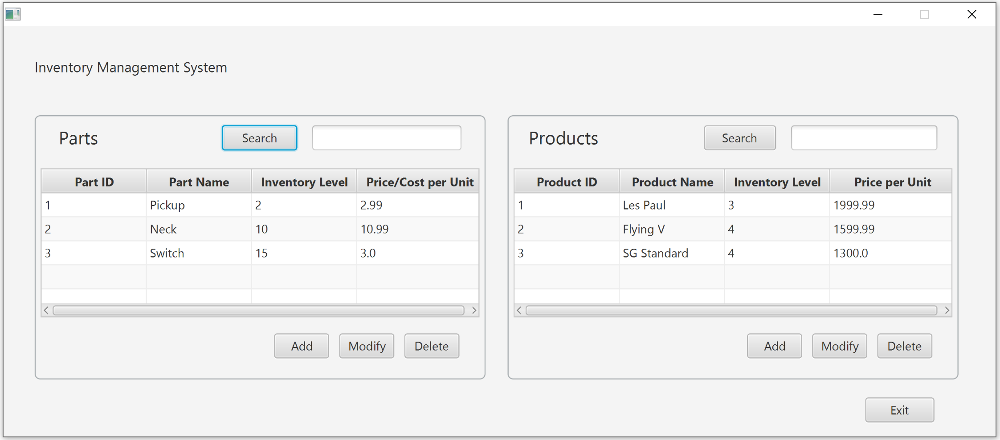
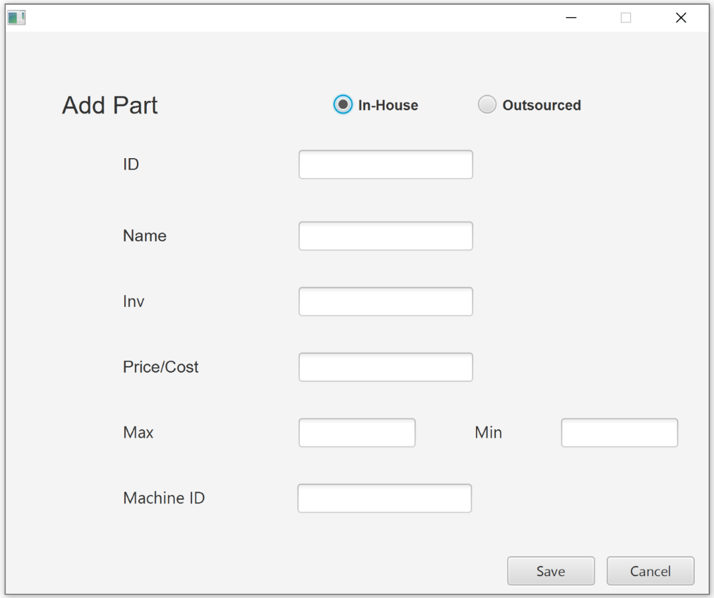
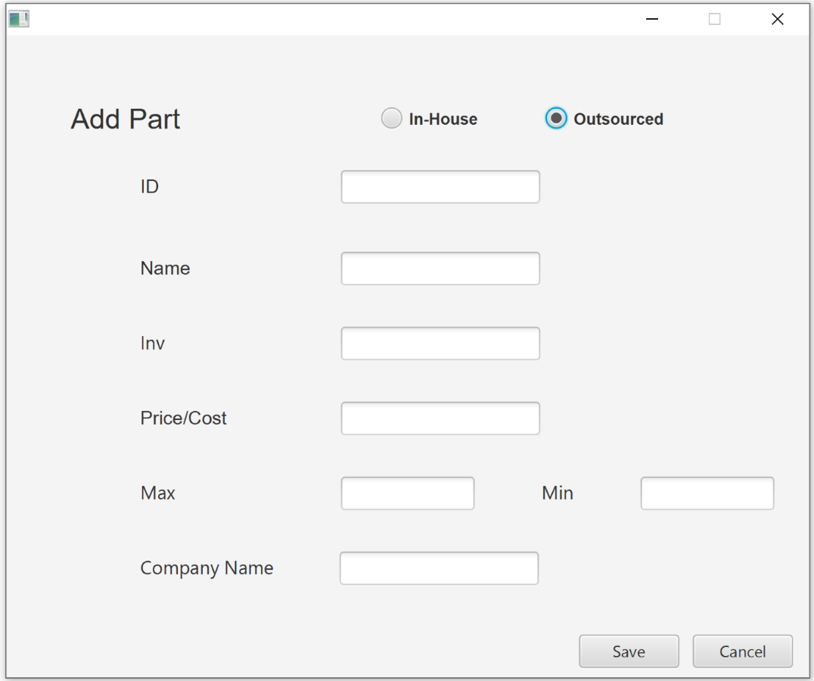
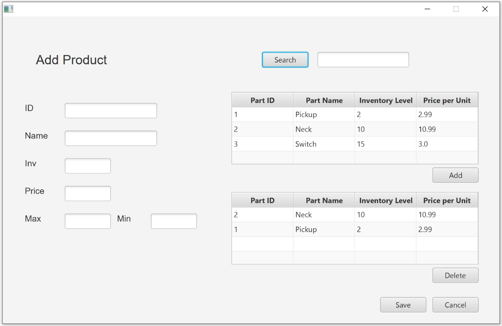
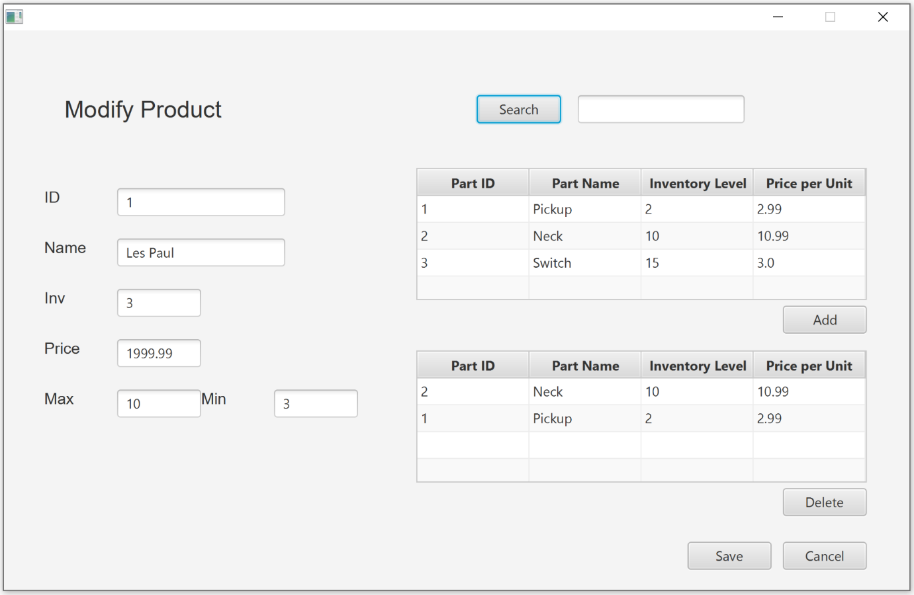

# InventoryProject

#### *This application is designed as an inventory management system for a small manufacturing company. The company can track their part and product information including price and inventory levels.*

The main screen of the application provides the following functionality:
* Add, modify, and delete parts
* Add, modify, and delete products
* Search for parts or products by name or ID

# Add Parts

*The Add Parts functionality utilizes polymorphism to change the attributes of a part based on whether it was 
produced in-house or if it was procured from an outside supplier.*

# Add Products

*The Add Products screen allows the user track the products that are produced.*

Product information includes:
* Name, ID, and Price
* The current number in inventory
* The maximum and minimum desired levels of inventory
* A table of available parts to choose from (upper table)
* A table of parts associated with the product being added (lower table)
* The ability to delete an associated part from a product
* The ability to search for a part by name or ID

# Modify Products

*The Modify Products screen allows the user to modify a product selected from the Main screen.*

